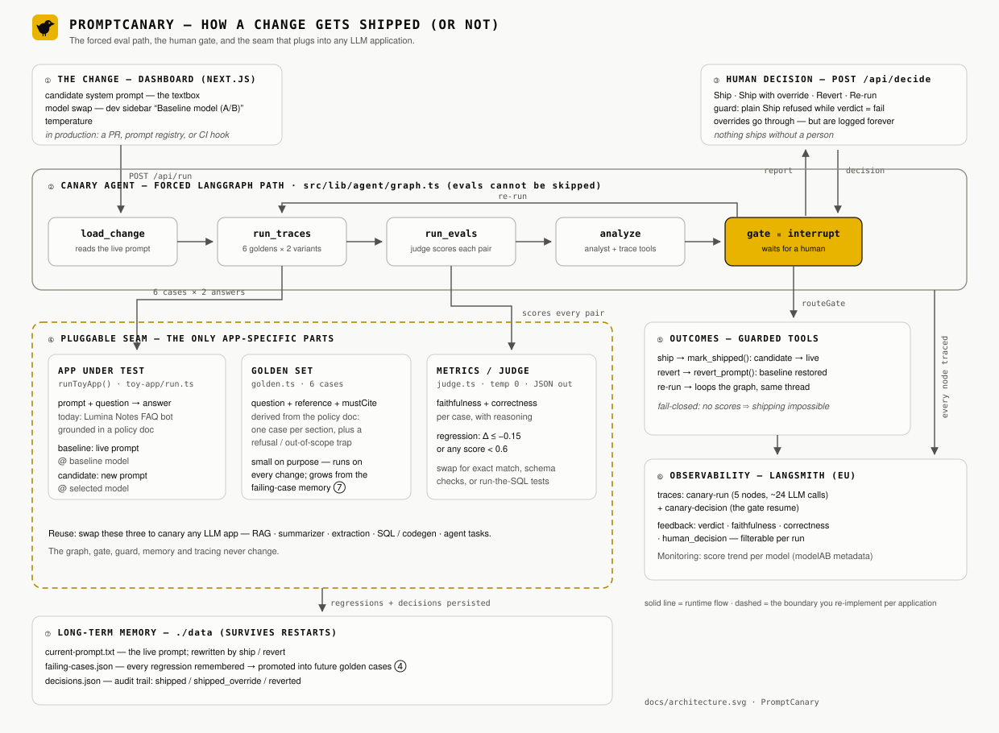
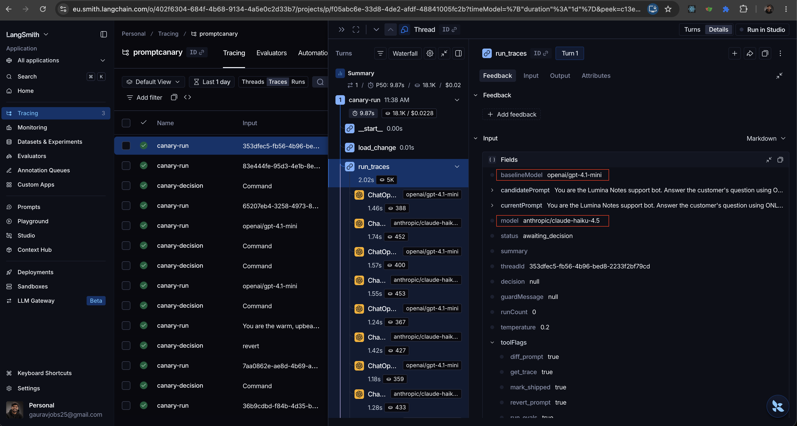

# PromptCanary

A LangGraph.js **system-monitoring agent** that watches a small LLM app, runs evals after a prompt or model change, and **will not mark the change shippable until you approve**.

Silent failures are the problem: status 200, the chat still looks fine, faithfulness already dropped. Cursor writes the change. PromptCanary sits on the gate.

Built with **Next.js (App Router, TypeScript) + LangGraph.js**.

**Users:** you (and any AI engineer) shipping an LLM feature.
**Not:** a content writer, a Cursor clone, or a medical chatbot.

Repo: [github.com/gauravthorath/PromptCanary](https://github.com/gauravthorath/PromptCanary)
Live demo: [promptcanary-eosin.vercel.app](https://promptcanary-eosin.vercel.app) (fixture mode unless you paste your own OpenRouter key)

## How it works

The bot under test is a bundled toy FAQ/policy bot ("Lumina Notes" support). PromptCanary runs a **forced** LangGraph path — not a `create_agent` hoping the model decides to call evals:



The dashed boundary (④) is the only application-specific code: swap the app-under-test runner, the golden set, and the metrics to point the same canary at a RAG pipeline, summarizer, extractor, SQL generator, or agent — the graph, gate, guard, memory and tracing are reused unchanged.

```
load_change → run_traces → run_evals → analyze → gate (interrupt)
                  ▲                                │
                  └────────────── re-run ──────────┤
                                          ship → mark_shipped → END
                                          revert → revert_prompt → END
```

- **run_traces** answers every golden case twice: with the live prompt (baseline) and the candidate.
- **run_evals** scores each answer with an LLM judge (faithfulness + correctness, structured output) and flags regressions (delta ≤ −0.15 or score < 0.6).
- **analyze** is a function-calling analyst: it can call `get_trace` and `diff_prompt` to explain *what got worse and why*.
- **gate** interrupts the graph. Nothing ships without a human decision, and a **security guard refuses a plain "ship" while evals are failing** — only an explicit recorded override gets through.
- **prompt-safety screen** (OWASP LLM01 mitigations): before tracing, the candidate prompt itself is checked by a deterministic lint (instruction override, role hijack, destructive imperatives, exfiltration, obfuscated payloads) plus an LLM review at temperature 0. Findings never skip the evals — behavior is still measured — they *taint* the run: the gate refuses a plain Ship and only a logged override ships. A third layer probes [OpenRouter's prompt-injection guardrail](https://openrouter.ai/docs/guides/features/guardrails/prompt-injection): the candidate is sent through the same gateway every runtime call uses, and a Block (403 with matched patterns) or Redact (`[PROMPT_INJECTION]` in the echo) becomes a finding too — so the guardrail assigned to your API key protects the toy app at runtime *and* speaks up before ship. Tone or grounding changes are deliberately not flagged; the eval suite owns behavior. Prompt injection has no complete fix — this is layered mitigation, and the fail-closed gate stays the real guard.

## Demo (90 seconds)

1. Bundled toy FAQ/policy bot — golden set is **green**.
2. Click **"Load demo change (planted regression)"** — a "friendlier" prompt that silently drops grounding + citations.
3. Run the canary: traces + evals + analyst report.
4. It shows **what got worse** (not a vibe): per-case faithfulness/correctness deltas.
5. **HITL:** Revert / Ship anyway (guarded override) / Re-run.

If step 4 is skipped, there is no package. That is the point.

On a public deploy with **no server API key**, the UI stays in **demo mode** (deterministic fixtures). Paste your own OpenRouter key in Developer settings for a live run.

## Setup & run

Requires **Node 20+**. An [OpenRouter API key](https://openrouter.ai/keys) is optional for local demo mode.

```bash
git clone https://github.com/gauravthorath/PromptCanary.git
cd PromptCanary
pnpm install
cp .env.example .env.local   # optional; paste a key for live evals
pnpm dev                     # http://localhost:3000
```

Runtime state lives in `./data` (gitignored): the live prompt, the failing-case memory and the ship/revert audit log.

```bash
pnpm test                    # unit tests (vitest)
pnpm lint
```

**API cost guards (public deploy):**

- No live model call without a key. Without a key the app uses fixtures.
- Paste your own OpenRouter key in Developer settings (this tab only, `sessionStorage`, sent as `x-openrouter-key`). It is never written to disk or logged.
- Shared server key (if you set `OPENROUTER_API_KEY` on the host): **4 live runs per IP per hour**.
- Visitor key: **12 live runs per IP per hour**.
- Candidate prompt capped at 8,000 characters.

Do **not** put a personal `OPENROUTER_API_KEY` on a public Vercel project. Leave it unset so visitors see demo mode unless they paste their own key.

**HITL on serverless:** the checkpointer is in-memory (`MemorySaver`) and runtime files live in `/tmp`. A Ship/Revert after a cold start may miss the paused thread, and memory does not persist across instances — run locally for a reliable gate, or swap the checkpointer for Postgres/SQLite. Hobby Vercel functions time out at 60s.

**OpenRouter guardrail (optional, recommended):** at openrouter.ai → Settings → Privacy → Guardrails create a guardrail, enable *Security → prompt injection* (Block or Redact), and assign it to the key. PromptCanary probes it on every candidate (one tiny request); `OPENROUTER_GUARDRAIL_PROBE=false` disables the probe.

### LangSmith observability

Uncomment the `LANGSMITH_*` block in `.env.local` (key from
[smith.langchain.com](https://smith.langchain.com)) and restart. The dev
sidebar shows a **LangSmith tracing on** indicator when it's active.

Every canary run lands in LangSmith as a single `canary-run` trace: the full
graph (`load_change → run_traces → run_evals → analyze → gate`), each
baseline/candidate model call, every judge call with its structured scores,
and the analyst's tool-calling loop. Resuming the gate produces a
`canary-decision` trace tagged with the human's decision, so a shipped
override is auditable end to end.

The outcome is also logged as LangSmith **feedback**: `verdict`, mean candidate
`faithfulness`/`correctness`, `human_decision`, and `prompt_safety`.

| The full graph as one trace | The judge catching the regression |
|---|---|
|  |  |

| Run-level feedback, filterable | The human decision, audited |
|---|---|
|  |  |




## Use cases

- "I rewrote the system prompt to be friendlier" → Canary shows faithfulness drop on citation questions.
- "I switched to a cheaper model" → suite fails goldens; you Revert.
- "Evals are green" → Approve ships; the failing-case memory stays empty.

## Technical decisions

- **Forced graph over a free agent:** evals must run every time; the model is never trusted to decide to eval itself.
- **Prompt screen is unit-tested, not just demoed:** `pnpm test` runs table-driven cases over every lint rule, the OpenRouter guardrail probe parser, and the gate's decision guard.
- **React Compiler, no hand memoization:** `reactCompiler: true` in `next.config.ts`.
- **Fail closed everywhere:** empty golden set, missing traces, disabled `run_evals`, judge/API errors — every one aborts the run instead of green-lighting it.
- **`MemorySaver` checkpointer** keeps this a single-process tool; swap for a Postgres/SQLite checkpointer to deploy HITL reliably on serverless.
- **Demo mode** (no API key) exercises the identical graph with deterministic fixtures.

## What this is not

- Not a replacement for Cursor.
- Not a production eval platform. It is a forced-path canary you can point at your own golden set.
