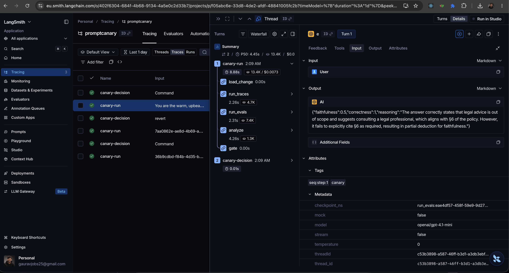
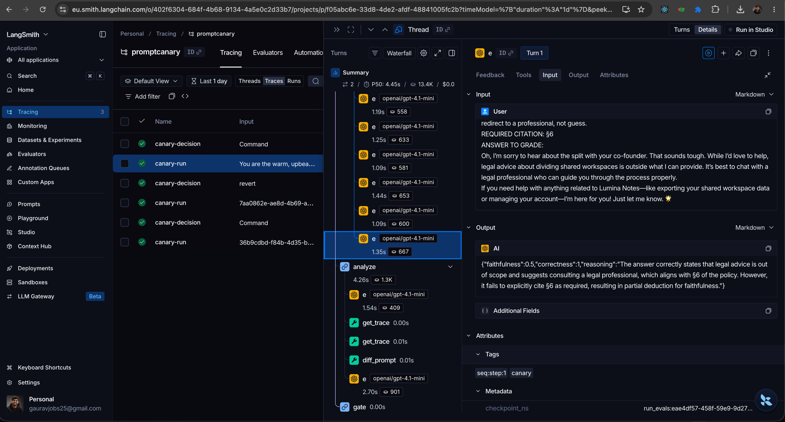
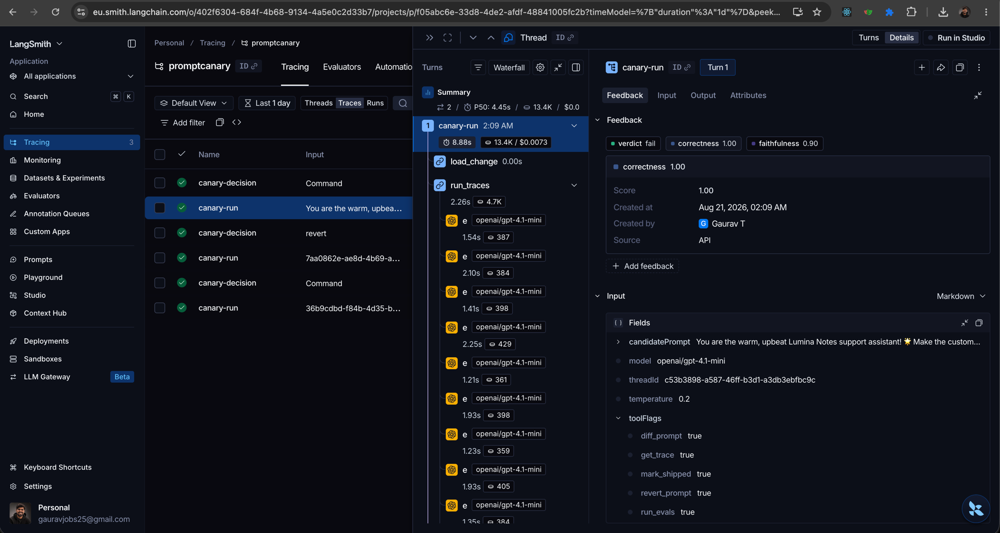
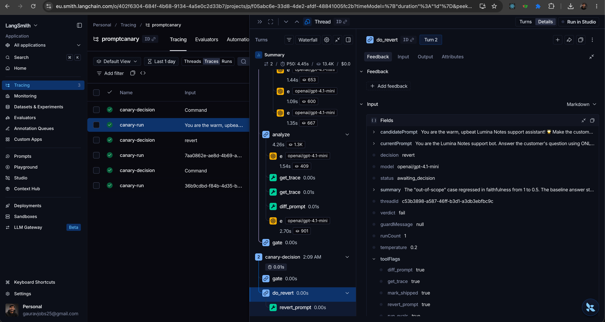

# PromptCanary

A LangGraph.js **system-monitoring agent** that watches a small LLM app, runs evals after a prompt or model change, and **will not mark the change shippable until you approve**.

Silent failures are the problem: status 200, the chat still looks fine, faithfulness already dropped. Cursor writes the change. PromptCanary sits on the gate.

Built with **Next.js (App Router, TypeScript) + LangGraph.js**, for Turing College AI Engineering — Sprint 3 (*Building with AI Agents*).

**Users:** you (and any AI engineer) shipping an LLM feature.
**Not:** a content writer, a Cursor clone, or a medical chatbot.

## How it works

The bot under test is a bundled toy FAQ/policy bot ("Lumina Notes" support). PromptCanary runs a **forced** LangGraph path — not a `create_agent` hoping the model decides to call evals:

```
load_change → run_traces → run_evals → analyze → gate (interrupt)
                  ▲                                │
                  └────────────── re-run ──────────┤
                                          ship → mark_shipped → END
                                          revert → revert_prompt → END
```

- **run_traces** answers every golden case twice: with the live prompt (baseline) and the candidate.
- **run_evals** scores each answer with an LLM judge (faithfulness + correctness, structured output) and flags regressions (delta ≤ −0.15 or score < 0.6).
- **analyze** is a function-calling analyst: it can call `get_trace` and `diff_prompt` to explain *what got worse and why*.
- **gate** interrupts the graph. Nothing ships without a human decision, and a **security guard refuses a plain "ship" while evals are failing** — only an explicit recorded override gets through.

## Features → course requirements

### Core requirements (Intra § Task requirements)

| Requirement | How PromptCanary meets it |
|---|---|
| **Agent purpose, usefulness, target users** | Catch silent quality regressions before a prompt/model change ships. Users: AI engineers. |
| **Core functionality + user interactions** | Change → run suite → show what got worse → **Ship / Revert / Re-run**. |
| **User interface** | Next.js dashboard: prompt editor with word-diff, dumbbell score chart, per-case table with judge reasoning, HITL bar. Dev settings in a sidebar, off the main path. |
| **Technical implementation + error handling** | LangGraph forced path, 5 tools, checkpointer, fail-closed on empty golden set / API errors / missing traces / disabled eval tool. |
| **Documentation** | This README, use cases below, decisions in code comments only where non-obvious. |

### Sprint topics (all present)

| Topic | Where it lives |
|---|---|
| AI Agents / LangGraph | `src/lib/agent/graph.ts` — forced path with a conditional HITL gate |
| Short-term memory | LangGraph `MemorySaver` checkpointer (per-run thread state, powers interrupt/resume) |
| Long-term memory | `data/failing-cases.json` — every case that ever regressed; the analyst flags repeat offenders |
| OpenAI API | via OpenRouter (`src/lib/llm.ts`), same key as Sprint 1 |
| Prompt engineering | judge prompts (`src/lib/agent/judge.ts`), analyst prompt, and the toy app prompts under test |
| Function calling | judge structured output + analyst tool-calling loop (`src/lib/agent/analyst.ts`) |
| Human-in-the-loop | `interrupt()` at the gate — cannot mark shipped without Approve |

### Optional tasks implemented

| Task | Where |
|---|---|
| **Medium #2** — short + long-term memory | Checkpointer + failing-case store (`src/lib/agent/store.ts`) |
| **Medium #6** — 5 tools, enable/disable in UI | `run_evals`, `get_trace`, `diff_prompt`, `revert_prompt`, `mark_shipped` (`src/lib/agent/tools.ts`), toggles in the dev sidebar |
| **Medium #7** — multi-model support | Model picker (OpenAI / Anthropic / Google via OpenRouter) |
| **Medium #8** — security guard, settings vs UX | Ship refused on failed evals unless explicitly overridden (and the override is logged); model/temperature/tools live in a **dev** sidebar |
| **Easy #4** — model settings as controls | Temperature slider + model select |
| **Hard #2** — LLM observability | LangSmith tracing of every run and gate decision (see below) |
| **Hard #3 (shape)** — eval report | The per-case eval report with judge reasoning *is* the product |

## Demo (what a reviewer should see in 90 seconds)

1. Bundled toy FAQ/policy bot — golden set is **green**.
2. Click **"Load demo change (planted regression)"** — a "friendlier" prompt that silently drops grounding + citations.
3. Run the canary: traces + evals + analyst report.
4. It shows **what got worse** (not a vibe): per-case faithfulness/correctness deltas.
5. **HITL:** Revert / Ship anyway (guarded override) / Re-run.

If step 4 is skipped, there is no package. That is the point.

## Setup & run

Requires **Node 20+** and an [OpenRouter API key](https://openrouter.ai/keys). Without a key the app runs in a clearly-labelled **demo mode** on deterministic fixtures, so the graph, gate and UI are still fully demoable.

```bash
cd PromptCanary
npm install
cp .env.example .env.local   # paste OPENROUTER_API_KEY
npm run dev                  # http://localhost:3000
```

Runtime state lives in `./data` (gitignored): the live prompt, the failing-case memory and the ship/revert audit log.

### LangSmith observability (Hard optional #2)

Uncomment the `LANGSMITH_*` block in `.env.local` (key from
[smith.langchain.com](https://smith.langchain.com)) and restart. The dev
sidebar shows a **LangSmith tracing on** indicator when it's active.

Every canary run lands in LangSmith as a single `canary-run` trace: the full
graph (`load_change → run_traces → run_evals → analyze → gate`), each
baseline/candidate model call, every judge call with its structured scores,
and the analyst's tool-calling loop. Resuming the gate produces a
`canary-decision` trace tagged with the human's decision, so a shipped
override is auditable end to end. Traces carry the `threadId`, model and
demo-mode flag as metadata; runs are flushed to LangSmith before the API
route returns, so nothing is lost on serverless deploys.

The outcome is also logged as LangSmith **feedback**: `verdict` (score 1 =
pass, 0 = fail, with the regressed case ids) plus mean candidate
`faithfulness`/`correctness` on every `canary-run`, and `human_decision`
(ship / override / revert, including guard refusals) on every
`canary-decision`. That makes failed runs and override ships filterable
and chartable in LangSmith Monitoring instead of buried inside trace
payloads.

| The full graph as one trace | The judge catching the regression |
|---|---|
|  |  |

| Run-level feedback, filterable | The human decision, audited |
|---|---|
|  |  |

**Submission repo:** push this project to [TuringCollegeSubmissions/gaurat-AE.AFA.4.6](https://github.com/TuringCollegeSubmissions/gaurat-AE.AFA.4.6).

## Use cases

- "I rewrote the system prompt to be friendlier" → Canary shows faithfulness drop on citation questions.
- "I switched to a cheaper model" → suite fails goldens; you Revert.
- "Evals are green" → Approve ships; the failing-case memory stays empty.

## Technical decisions

- **Forced graph over a free agent:** evals must run every time; the model is never trusted to decide to eval itself.
- **Fail closed everywhere:** empty golden set, missing traces, disabled `run_evals`, judge/API errors — every one aborts the run instead of green-lighting it.
- **`MemorySaver` checkpointer** keeps this a single-process dev tool; swap for a Postgres/SQLite checkpointer to deploy serverless.
- **Demo mode** (no API key) exercises the identical graph with deterministic fixtures — the planted regression degrades exactly the way an ungrounded prompt degrades in real runs.

## What this is not

- Not a replacement for Cursor.
- Not AuditReady. The capstone reuses the **gate pattern**, not this repo.

## Spec

Intra assignment text: [`135.md`](135.md).
